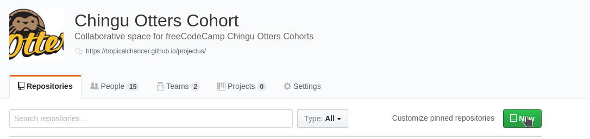
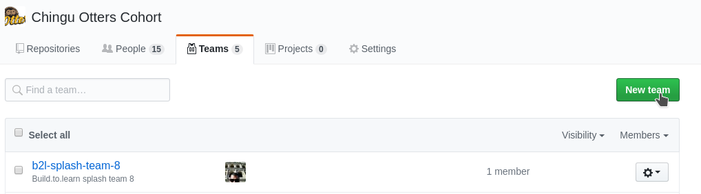

# GitHub-tips
The purpose of this repo is to host tips in using GitHub and Git by and for the Chingu Otters cohort.

It is also a means to practice GitHub workflows using a simple markdown file (this one). This could also be done using a [GitHub wiki](https://help.github.com/articles/about-github-wikis/) but the workflows are different so we'll just use this README.md file and some images à la the [Open Guide to AWS](https://github.com/open-guides/og-aws).

## Note from Original Author

I am very new to learning all of these GitHub workflows myself so both patience and corrections are very much welcome! -[Josh Morel](https://github.com/joshmorel) 

## Working with Organizations

Note: Much of this is distilled from the [information provided here](https://help.github.com/categories/setting-up-and-managing-organizations-and-teams/)

### Organization and Roles

We started by creating an organization for [our cohort](https://github.com/orgs/chingu-otters). All members who requested access were added with the **Member** role. With the **Member** role, you can:

1. Create repos
1. Create teams and be made a team maintainer
1. See all members and teams
1. Create or delete project board and edit description 

There is also a **Owner** role who can invite and delete members, add billing information and delete the organization. My plan is to give active members the **Owner** role.

### Teams and Organization Repos

#### Organization Repos 

As mentioned previously all team members have the ability to create organization repos. They then have the ability to change permissions on that [repo for different users](https://help.github.com/articles/repository-permission-levels-for-an-organization/#changing-repository-settings]) so that specific people can collaborate.

To create a repo simply click on the **Repositories** tab then click **New**:

To streamline and better organize permissions on a repo there are **Teams**.

#### Teams

Any organization member can create a team. To do so, click on the **Teams** tab then click **New**. 

After creation, you will be taken to the team page. Here you can add members by clicking the **Add a member** button then search by username, full name, or email. Click on the user to add them. You will be prompted for your password before continuing. 

If they are in the organization they will automatically added. If they are not, then an invite will be sent to them which they must accept. For more [ the docs](https://help.github.com/articles/adding-organization-members-to-a-team/).

After adding, team members can be promoted to the **Maintainer** role. Maintainers have the [following permissions](https://help.github.com/articles/repository-permission-levels-for-an-organization/#team-maintainers). 

#### Team Repos

Those with admin access to an organization repo (the creator, those granted admin access, or the organization owner) can add that repo to any team they belong to. To do so, click on the **Repositorires** tab, click **Add repository** then search for the repo and select it.

Now all members of the team will have Admin access. This access can be changed by navigating to **Settings** then **Collaborators & team** within the repo. More about repository permission levels can be [read here](https://help.github.com/articles/repository-permission-levels-for-an-organization/).

TODO: Workflows between organization, individual on GitHub and local.